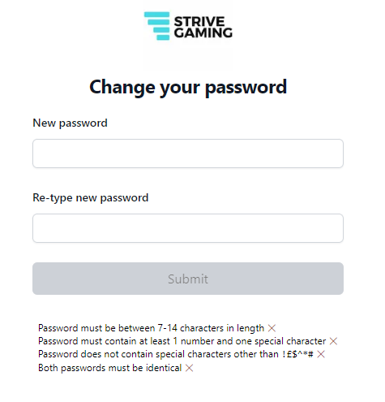
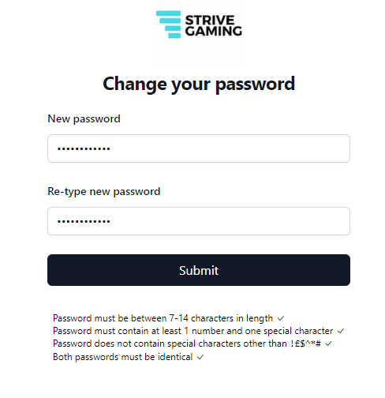

# Programming Exercise v.1.1.0

This is a programming exercise using C# (.NET 7), react, typescript and tailwind. 

You have been given two code skeletons. One is for a front end web client, the other is a web API. 

The web client only has one page, a simple form that allows a user to change their password. It does some checks to make sure the password is valid.

The web api has one end point (password/change). This accepts accepts the new password and does a final check.

Using the guidance below, add code to both projects to get them working together. 

### Guidance

1. You will need to add code to /pages/index.tsx to make the password validator work properly. As the various password validation requirement are met, the requirements listed on the page should change accordingly. We've added bootstrap-icons, so you can use the CSS classes 'bi-check-lg' and 'bi-x-lg' for the check marks and crosses (see below).

2. The SUBMIT button should be disabled until all validation requirements are met.

3. When a password is valid, your page should post it to the /password/change endpoint. 

4. If the password is invalid or on the list of commonly used passwords (see /Data), the backend should return status code 400. Display a suitable message to the user. Passwords that are valid but on the commonly used list include - password123!, admin1##, and router911*. You need to check every password against every entry on this list.

5. If the password is valid and does not appear on the list of commonly used password, the backend should return status code 200. Display a suitable message to the user.

6. Extra credit for unit tests (front end or back end or both). We have set up Jest and XUnit for you.

7. Feel free to make any style (CSS) changes you want.

8. Submit your solution to HR 24 hours before your interview so we can review it.

Please don't spend any longer than 1-2 hours on this exercise. Even if you don't get everything done, we don't want you wasting your time. Just bring ideas on improvements or how you'd resolve something to the interview itself.

## Goal






## Submitting your work

We recommend the following approaches:

1. Upload your work to a private repository on GitHub, then give access to the following users: mark-truran, danielcharlton_strivegaming. This is the preferred approach.
2. Clean your project, zip up the remaining files, upload them to a Cloud drive and send HR a link. Please do not submit unnecessary files (e.g. anything in /bin, /obj, /node_modules etc.) 

## Client project info

This is a [Next.js](https://nextjs.org/) project bootstrapped with [`create-next-app`](https://github.com/vercel/next.js/tree/canary/packages/create-next-app).

## Getting Started

First, run the development server:

```bash
npm run dev
```

Open [http://localhost:3000](http://localhost:3000) with your browser to see the result.

You can test the app using 

```bash
npm test
```

## Server project info

This is a bog standard web API project, serving on http://localhost:5291. We have fixed the CORS to allow communication with the client. You are welcome :)

